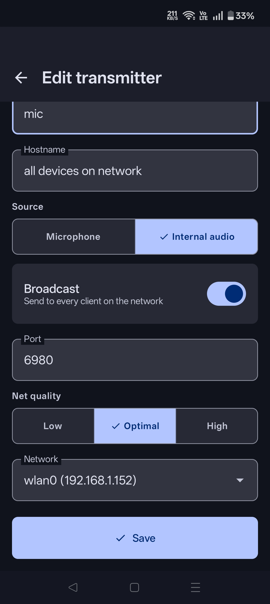
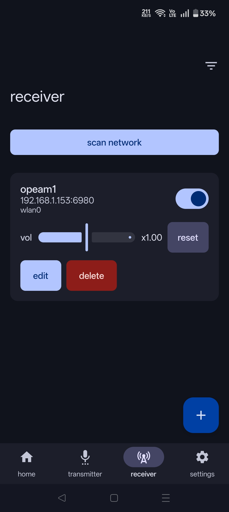
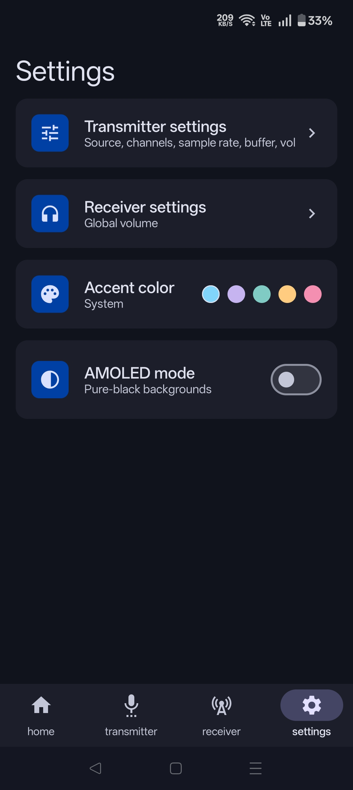

# AudioLAN

AudioLAN is an Android app for sending and receiving low-latency PCM audio over a local network using VBAN-compatible UDP streams. It supports microphone streaming, device audio capture, receiver playback, network discovery, and simultaneous multi-network transmit/receive over Wi-Fi and USB tethering.

## Screenshots

| Home | Create Transmitter |
| --- | --- |
|  |  |

| Receiver | Settings |
| --- | --- |
|  |  |

## Features

- Stream microphone audio from Android to VBAN receivers such as Voicemeeter.
- Stream Android playback/cast audio using MediaProjection audio capture.
- Receive VBAN audio streams on Android, including non-16-bit PCM and float formats normalized for playback.
- Discover compatible streams and devices on the network, with the source network shown per discovered stream and self-originated streams flagged to prevent feedback loops.
- Configure per-stream host, port, network, quality, volume, and enable state. Volume changes apply live without interrupting playback.
- Select any active network interface per stream (Wi-Fi, USB tethering, etc.), with support for transmitting and receiving across multiple networks at the same time.
- Automatic receiver recovery after a transmitter is stopped and restarted.
- Foreground services for microphone, cast, receiver, and discovery workflows.
- Dark UI with selectable accent colors, system accent support, and AMOLED background mode, following Material 3 design.

## Requirements

- Android Studio or Android Gradle Plugin compatible environment.
- JDK 17.
- Android SDK with compile SDK 35.
- Android device/emulator running Android 12 or newer, because `minSdk` is 31.
- For microphone streaming: microphone permission.
- For cast/audio playback capture: Android screen/audio capture consent.
- For Voicemeeter integration: VBAN enabled on the desktop side.

## Project Structure

```text
app/                  Android application module
app/src/main/java/    Kotlin source code
app/src/main/res/     Android resources, icons, themes
gradle/               Gradle wrapper files
commonMain/           Shared project area
```

## Build Debug APK

```powershell
.\gradlew.bat assembleDebug
```

Debug APK output:

```text
app\build\outputs\apk\debug\app-debug.apk
```

Install on a connected Android device:

```powershell
adb install -r app\build\outputs\apk\debug\app-debug.apk
```

## Run Tests

```powershell
.\gradlew.bat test
```

## Release Signing

Release signing uses a local `keystore.properties` file. This file is intentionally ignored by Git and must not be committed.

Create `keystore.properties` in the repo root:

```properties
storeFile=audiolan-release.jks
storePassword=YOUR_STORE_PASSWORD
keyAlias=YOUR_KEY_ALIAS
keyPassword=YOUR_KEY_PASSWORD
```

Keep the following secure:

- Release `.jks` keystore file
- Keystore password
- Key alias
- Key password
- Any private backup containing those values

Build a signed release APK:

```powershell
.\gradlew.bat assembleRelease
```

APK output:

```text
app\build\outputs\apk\release\app-release.apk
```

Build a signed Android App Bundle for store publishing:

```powershell
.\gradlew.bat bundleRelease
```

AAB output:

```text
app\build\outputs\bundle\release\app-release.aab
```

## Versioning

Version values are defined in `app/build.gradle.kts`:

```kotlin
versionCode = 100
versionName = "1.0.0"
```

For every published update, increase `versionCode`. Android requires `versionCode` to be an integer.

## Network Selection & Multi-Network Support

Each stream selects its network from the device's currently active interfaces (Wi-Fi, USB tethering, etc.) instead of a fixed transport type. Different streams can target different networks at the same time, and the receiver listens across all active networks simultaneously rather than being limited to one. USB tethering uses Android USB tethering as an IP network link; it is not USB Audio Class and does not create a direct USB audio device. The app still sends and receives VBAN-compatible UDP packets, just routed over whichever interface a stream selects.

## Notes

- Receiver playback decodes PCM VBAN streams, including 8/16/24/32-bit integer and 32/64-bit float formats, and includes jitter buffering, stereo playback handling, and automatic recovery if the sender restarts.
- Network discovery is intended for receiver setup and stream detection. Streams originating from the same device are shown but cannot be saved as receiver streams, to prevent audio feedback loops.
- Release artifacts, local SDK config, build outputs, and signing files are excluded from Git through `.gitignore`.